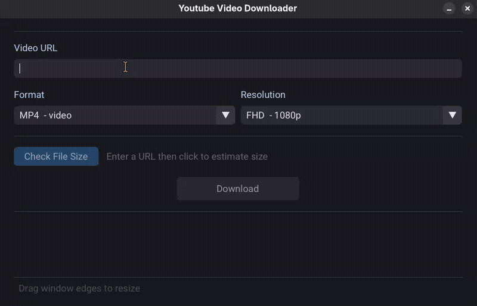

# YouTube Video Downloader

A clean, modern desktop app for downloading YouTube videos and audio.



## Built With

- **C++23**
- **Dear ImGui** — GUI framework
- **Raylib** — Window management
- **yt-dlp** — Video download backend
- **ffmpeg** — Media processing

## Build

```bash
mkdir -p build; cd build; cmake -G Ninja -DCMAKE_BUILD_TYPE=Release ..; ninja -j8
```

For Windows, the build produces an executable (`.exe`).  
For Linux, run `./AppImage.sh` to package as AppImage.

## Platforms

Windows • Linux