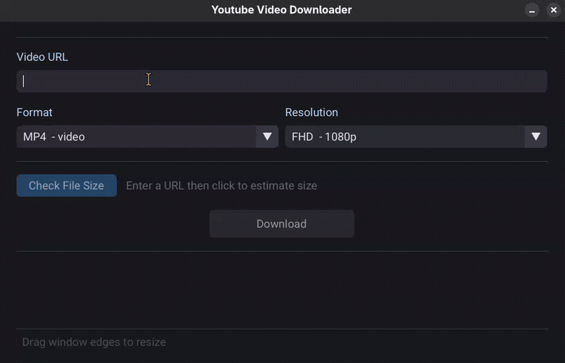

# YouTube Video Downloader

A clean, modern desktop app for downloading YouTube videos and audio.



## Built With

- **C++23**
- **Dear ImGui** — GUI framework
- **Raylib** — Window management
- **yt-dlp** — Video download backend
- **ffmpeg** — Media processing

## Build

```bash
mkdir -p build; cd build; cmake -G Ninja -DCMAKE_BUILD_TYPE=Release ..; ninja -j8
```

### macOS (build + run)

This project requires CMake `>= 3.27` and a C++23-capable Clang (Xcode 15+ recommended).

1) Install Xcode Command Line Tools:

```bash
xcode-select --install
```

2) Install build tools (Homebrew recommended):

```bash
brew install cmake ninja
```

3) Configure + build (Ninja):

```bash
cmake -S . -B build -G Ninja -DCMAKE_BUILD_TYPE=Release
cmake --build build -j
```

4) Run:

```bash
./build/ytv_downloader
```

If Ninja isn’t available, build with Xcode instead:

```bash
cmake -S . -B build-xcode -G Xcode
cmake --build build-xcode --config Release
./build-xcode/Release/ytv_downloader
```

If you hit C++23 / `<format>` compiler errors on older Xcode, use Homebrew LLVM:

```bash
brew install llvm
export CC="$(brew --prefix llvm)/bin/clang"
export CXX="$(brew --prefix llvm)/bin/clang++"
cmake -S . -B build -G Ninja -DCMAKE_BUILD_TYPE=Release
cmake --build build -j
./build/ytv_downloader
```

For Windows, the build produces an executable (`.exe`).  
For Linux, run `./AppImage.sh` to package as AppImage.

## Platforms

Windows • Linux • macOS
